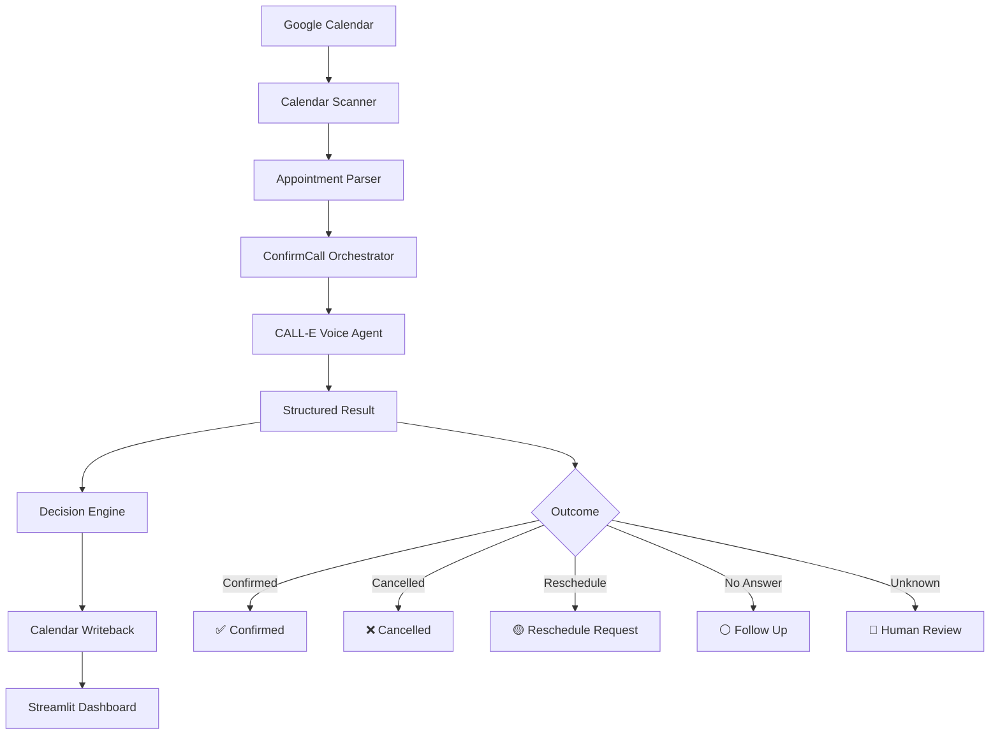

Absolutely. Below is a polished, hackathon-ready README that highlights the full scope of what you have actually built without overstating the one thing still pending: a real supported-region CALL-E phone call.

I’ve also structured it around what the hackathon judges explicitly care about: real-world impact, idea quality, technical implementation, and product/demo quality. 

Copy this into your `README.md`.

````markdown
# ☎️ ConfirmCall

### AI-powered appointment confirmation and no-show reduction for service businesses

> **Google Calendar → CALL-E Voice Agent → Structured Decision → Calendar Writeback → Dashboard**

ConfirmCall is an AI appointment confirmation agent that helps appointment-based businesses reduce no-shows, save staff time, and capture customer intent automatically.

Instead of employees manually calling customers before every appointment, ConfirmCall reads upcoming appointments from Google Calendar, prepares a personalized confirmation conversation, processes the customer's response, converts it into a structured outcome, and writes the result directly back to the calendar.

---

## 🚀 Why ConfirmCall?

Appointment no-shows create a simple but expensive problem.

Businesses such as:

- salons,
- consultants,
- repair services,
- tutors,
- service providers,
- and other appointment-based businesses

often spend hours manually contacting customers to determine whether they still plan to attend.

When those calls are not made, businesses may discover a cancellation only after the appointment slot has already been wasted.

ConfirmCall turns this manual process into an automated workflow.

Instead of:

```text
Appointment created
        ↓
Staff remembers to call
        ↓
Customer responds
        ↓
Staff manually records response
        ↓
Calendar updated
````

ConfirmCall provides:

```text
Appointment created
        ↓
Google Calendar
        ↓
ConfirmCall
        ↓
CALL-E Voice Agent
        ↓
Customer response
        ↓
Structured decision
        ↓
Google Calendar updated automatically
        ↓
Dashboard reflects result
```

---

# ✨ Core Features

## 📅 Google Calendar Integration

ConfirmCall uses Google Calendar as both its appointment source and operational system of record.

It can:

* authenticate through Google OAuth 2.0,
* read upcoming calendar events,
* identify ConfirmCall-enabled appointments,
* extract customer and appointment metadata,
* determine current appointment status,
* update appointment outcomes,
* store CALL-E call IDs,
* store requested reschedule times,
* and update event titles with visual status indicators.

Example ConfirmCall Calendar metadata:

```text
CONFIRMCALL=true
CUSTOMER_NAME=Alice Demo
CUSTOMER_PHONE=+15551234567
SERVICE=Haircut Appointment
STATUS=pending
```

After processing:

```text
CONFIRMCALL=true
CUSTOMER_NAME=Clara Demo
CUSTOMER_PHONE=+15551234567
SERVICE=Service Visit
STATUS=reschedule_requested
REQUESTED_TIME=Monday at 2:00 PM
CALL_ID=demo-call-clara
```

---

## ☎️ CALL-E Voice Agent Integration

ConfirmCall integrates with the CALL-E Python SDK.

The CALL-E service layer can:

* construct personalized appointment confirmation tasks,
* create CALL-E calls,
* provide structured result schemas,
* attach event metadata,
* use idempotency keys,
* wait for the completed call,
* retrieve structured results,
* and convert those results into ConfirmCall decisions.

Example task:

```text
You are ConfirmCall, an appointment confirmation assistant.

Speak with the customer about their upcoming appointment.

Politely ask whether they will attend.

If they cannot attend, determine whether they want to cancel
or request another time.

Do not promise that a requested new time is confirmed.

Return one structured outcome:
confirmed
cancelled
reschedule_requested
no_answer
unknown
```

---

## 🧠 Structured Decision Engine

CALL-E results are converted into standardized appointment states.

ConfirmCall supports:

| Outcome                 | Meaning                            |
| ----------------------- | ---------------------------------- |
| ✅ Confirmed             | Customer intends to attend         |
| ❌ Cancelled             | Customer cancelled                 |
| 🟡 Reschedule Requested | Customer wants another time        |
| ⚪ No Answer             | Customer could not be reached      |
| 🔴 Needs Human          | Result requires manual review      |
| ⏳ Pending               | Appointment has not been processed |

The decision engine intentionally separates conversation understanding from business actions.

That means additional communication providers could be integrated later without changing the underlying decision logic.

---

## 🔁 Rescheduling Without Over-Promising

A customer may request another appointment time during the conversation.

ConfirmCall records that request but deliberately does **not** promise the slot is available.

Example:

```text
Customer:
"Can I move it to Monday at 2 PM?"

ConfirmCall result:
reschedule_requested

Requested time:
Monday at 2:00 PM
```

The request is written back to Google Calendar for review.

This keeps the AI useful without allowing it to make scheduling commitments it cannot verify.

---

# 🖥️ ConfirmCall Dashboard

ConfirmCall includes a Streamlit dashboard providing a live operational view of upcoming appointments.

The dashboard displays:

* total appointments,
* confirmed appointments,
* cancellations,
* pending appointments,
* appointments requiring action,
* requested reschedule times,
* confirmation rate,
* estimated revenue protected,
* and individual appointment statuses.

Example:

```text
☎️ ConfirmCall
AI Appointment Confirmation Agent

Appointments   Confirmed   Cancelled   Pending   Needs Action
     4             2           1          0           1
```

---

## 💰 Business Impact Metrics

The dashboard converts technical results into business-facing metrics.

Examples include:

```text
Appointments Protected
2

Estimated Revenue Protected
$200

Confirmation Rate
50%
```

Revenue protection is clearly labeled as a demo estimate based on a configurable average appointment value.

---

# 🎬 Repeatable Demo Mode

ConfirmCall includes a repeatable demo workflow designed for testing and demonstrations.

Three demo appointments represent different real-world outcomes:

| Customer   | Scenario              |
| ---------- | --------------------- |
| Alice Demo | Confirms appointment  |
| Brian Demo | Cancels appointment   |
| Clara Demo | Requests rescheduling |

### Before ConfirmCall

```text
Alice Demo    ⏳ Pending
Brian Demo    ⏳ Pending
Clara Demo    ⏳ Pending
```

Click:

```text
☎️ Run ConfirmCall
```

### After ConfirmCall

```text
Alice Demo
✅ Confirmed

Brian Demo
❌ Cancelled

Clara Demo
🟡 Reschedule Requested
Requested Time: Monday at 2:00 PM
```

These results are written to the real Google Calendar integration.

The dashboard can then reset the appointments using:

```text
🔄 Reset Demo
```

allowing the demonstration to be repeated without manually editing Calendar events.

---

# 🏗️ Architecture



---

# 🔄 End-to-End Workflow

## 1. Appointment Detection

ConfirmCall scans upcoming Google Calendar events.

Only events containing:

```text
CONFIRMCALL=true
```

are processed.

---

## 2. Appointment Parsing

Calendar metadata is transformed into an internal `Appointment` model containing:

```python
event_id
customer_name
customer_phone
service_name
start_time
status
requested_time
call_id
```

---

## 3. CALL-E Task Generation

ConfirmCall generates a personalized voice-agent task using:

```python
build_call_task(appointment)
```

The conversation includes:

* customer name,
* service,
* appointment date,
* appointment time,
* confirmation request,
* cancellation handling,
* and rescheduling instructions.

---

## 4. Structured Result

CALL-E is configured to return:

```json
{
  "outcome": "confirmed",
  "requested_time": "",
  "customer_notes": "Customer confirmed attendance."
}
```

Supported values:

```text
confirmed
cancelled
reschedule_requested
no_answer
unknown
```

---

## 5. Decision Engine

The structured result passes through:

```python
apply_call_result()
```

which converts the result into a standardized appointment status.

---

## 6. Calendar Writeback

Google Calendar is updated automatically.

Examples:

```text
✅ Haircut Appointment
```

```text
❌ Consultation
```

```text
🟡 Service Visit
```

---

## 7. Dashboard Update

The Streamlit application reloads the Calendar data and displays the latest state.

This creates a closed operational loop:

```text
Calendar
   ↓
Conversation
   ↓
Decision
   ↓
Calendar
   ↓
Dashboard
```

---

# 🔐 Duplicate Call Protection

ConfirmCall uses idempotency keys when creating CALL-E calls.

The key is generated from:

```text
confirmcall:<event_id>:<appointment_time>
```

Example:

```text
confirmcall:abc123:2026-09-13T10:00:00+01:00
```

This helps prevent the same appointment from accidentally creating duplicate calls.

ConfirmCall also checks appointment status and skips appointments that have already been processed.

---

# 🧪 Automated Testing

ConfirmCall uses `pytest`.

Current decision-engine test suite:

```text
test_confirmed
test_cancelled
test_reschedule_requested
test_no_answer
test_unknown_goes_to_human
```

Current result:

```text
============================
5 passed
============================
```

The tests verify that CALL-E outcomes are mapped correctly into appointment states.

---

# 🛡️ Safe Demo / Live Mode Separation

ConfirmCall currently supports:

```python
DRY_RUN = True
```

When enabled, CALL-E conversation outcomes are simulated while the rest of the system remains real.

The following components still operate normally:

```text
Real Google Calendar read
        ↓
Real appointment parser
        ↓
Simulated CALL-E result
        ↓
Real decision engine
        ↓
Real Google Calendar writeback
        ↓
Real dashboard update
```

This allows the full workflow to be demonstrated repeatedly without placing unnecessary phone calls.

---

# ☎️ Live CALL-E Support

A production CALL-E adapter is implemented using:

```python
CalleClient
```

and:

```python
client.calls.create_and_wait(...)
```

The integration supports:

* CALL-E API authentication,
* recipient normalization,
* task generation,
* result schemas,
* metadata,
* idempotency,
* status polling,
* completed call retrieval,
* structured result extraction,
* and call ID persistence.

A dedicated live-call harness is included:

```text
live_call_test.py
```

It requires explicit confirmation before initiating the call.

> Live calls must use an authorized phone number in a CALL-E-supported calling region.

---

# 🔧 CALL-E SDK Exploration

During development, the installed CALL-E SDK was inspected to verify the exact API contract rather than relying on assumptions.

Confirmed CALL-E call methods include:

```text
create
create_and_wait
get
list_events
wait_for_result
```

The application uses the verified `create_and_wait()` workflow.

The SDK normalizes:

```python
{
    "phone": "..."
}
```

into the recipient structure required by CALL-E.

---

# 📂 Project Structure

```text
confirmcall/
│
├── app.py
│
├── live_call_test.py
│
├── seed_demo_events.py
│
├── test_calendar.py
│
├── test_calle.py
│
├── test_writeback.py
│
├── requirements.txt
│
├── README.md
│
├── .env.example
│
├── .gitignore
│
├── models/
│   ├── __init__.py
│   └── appointment.py
│
├── services/
│   ├── __init__.py
│   ├── calendar_service.py
│   ├── calle_service.py
│   └── decision_service.py
│
├── dashboard/
│   └── dashboard.py
│
└── tests/
    ├── __init__.py
    └── test_decision.py
```

---

# 🛠️ Technology Stack

### Backend

* Python 3.12
* CALL-E Python SDK
* Google Calendar API
* Google OAuth 2.0

### Frontend

* Streamlit
* Pandas

### Testing

* Pytest

### Configuration

* python-dotenv

### Development

* Git
* GitHub
* PowerShell
* VS Code

---

# ⚙️ Installation

Clone the repository:

```bash
git clone https://github.com/pmman-sudo/confirmcall.git
cd confirmcall
```

Create a virtual environment:

### Windows

```powershell
python -m venv .venv
.venv\Scripts\Activate.ps1
```

Install dependencies:

```powershell
python -m pip install -r requirements.txt
```

---

# 🔑 Environment Variables

Copy:

```text
.env.example
```

to:

```text
.env
```

Configure:

```env
CALLE_API_KEY=your_calle_api_key_here

CALLE_TEST_PHONE=your_authorized_test_number_here

CALLE_REGION=

CALLE_LOCALE=
```

Never commit `.env`.

---

# 📅 Google Calendar Setup

## 1. Create a Google Cloud Project

Create a project in Google Cloud Console.

---

## 2. Enable Google Calendar API

Enable:

```text
Google Calendar API
```

---

## 3. Configure Google OAuth

Create an OAuth Desktop Application.

Download the OAuth credentials file.

Rename it:

```text
credentials.json
```

Place it in the project root.

---

## 4. First Authentication

Run:

```powershell
python test_calendar.py
```

A browser window opens for Google authorization.

After successful authentication:

```text
token.json
```

is generated automatically.

---

# ▶️ Running ConfirmCall

## Run the CLI Workflow

```powershell
python app.py
```

---

## Run the Dashboard

```powershell
python -m streamlit run dashboard\dashboard.py
```

Then visit:

```text
http://localhost:8501
```

---

# 🌱 Seed Demo Appointments

Create the demo appointments:

```powershell
python seed_demo_events.py
```

This creates:

```text
Alice Demo
Brian Demo
Clara Demo
```

in Google Calendar.

---

# 🔄 Reset Demo Appointments

The dashboard provides:

```text
🔄 Reset Demo
```

This restores the three demo appointments to:

```text
STATUS=pending
```

and removes previous:

```text
REQUESTED_TIME
CALL_ID
```

values.

---

# ☎️ Run ConfirmCall

From the dashboard:

```text
☎️ Run ConfirmCall
```

ConfirmCall scans pending appointments and processes each one.

Already processed appointments are automatically skipped.

---

# 🧪 Run Tests

```powershell
python -m pytest -v
```

Expected:

```text
5 passed
```

---

# 🔒 Security

Sensitive credentials are excluded through `.gitignore`.

The following files must never be committed:

```text
.env
credentials.json
token.json
```

ConfirmCall includes:

```text
.env.example
```

containing placeholders only.

All demo customer information is fictional.

---

# 💡 Design Decisions

## Google Calendar as the Operational Database

Rather than requiring a business to immediately adopt another CRM, ConfirmCall works directly with a tool many small businesses already understand.

---

## Human-in-the-Loop Rescheduling

ConfirmCall records requested times instead of automatically promising that a replacement slot exists.

This keeps businesses in control.

---

## Structured Voice Results

The phone conversation is converted into machine-readable operational data rather than remaining only as a transcript.

---

## Provider Separation

CALL-E integration, Calendar integration, and decision logic are separated into independent services.

This makes the application easier to extend and test.

---

## Idempotent Calling

Calls use deterministic idempotency keys to reduce accidental duplicate outreach.

---

# 📈 Potential Business Model

ConfirmCall could evolve into a SaaS product for appointment-based businesses.

Possible plans could eventually be based on:

* monthly appointment volume,
* number of business locations,
* call volume,
* team members,
* integrations,
* analytics,
* and automated rescheduling.

Potential customer segments include:

```text
Salons
Barbers
Consultants
Home-service providers
Repair businesses
Tutors
Professional services
Appointment-based SMBs
```

---

# 🛣️ Roadmap

## Phase 1 — Hackathon MVP

* [x] Google Calendar authentication
* [x] Calendar event scanning
* [x] Appointment metadata parsing
* [x] Appointment domain model
* [x] CALL-E SDK integration
* [x] Structured result schema
* [x] Confirmation handling
* [x] Cancellation handling
* [x] Reschedule-request handling
* [x] No-answer handling
* [x] Human escalation
* [x] Calendar writeback
* [x] CALL-ID persistence
* [x] Requested-time persistence
* [x] Duplicate-processing protection
* [x] Idempotency support
* [x] Streamlit dashboard
* [x] Demo reset workflow
* [x] Business metrics
* [x] Automated tests
* [x] Live-call test harness
* [ ] Authorized supported-region live CALL-E call

---

## Phase 2 — Smarter Scheduling

Planned:

* calendar availability checking,
* automatic slot suggestions,
* business-hours validation,
* conflict detection,
* confirmed rescheduling.

---

## Phase 3 — Multi-Channel Follow-Up

Potential integrations:

* SMS,
* email,
* WhatsApp,
* CRM systems.

---

## Phase 4 — Business Platform

Future capabilities:

* multi-business accounts,
* team dashboards,
* configurable conversation scripts,
* appointment analytics,
* no-show analytics,
* custom appointment values,
* scheduled calling windows,
* retry policies,
* webhook processing,
* multi-calendar support,
* role-based access control.

---

# 🏆 Hackathon

ConfirmCall was built for:

## CALL-E: Your Code Is Calling

The challenge is centered on building AI agents that move beyond text and use phone calls to complete real-world tasks.

ConfirmCall focuses on one specific business problem:

> **Reducing appointment no-shows by turning real customer conversations into structured operational actions.**

Rather than stopping after the AI call, ConfirmCall closes the loop by updating the business's existing calendar automatically.

---

# 🎯 Why ConfirmCall Matters

The value is not simply:

> "AI can make a phone call."

The value is:

```text
AI discovers an operational task
        ↓
AI performs the conversation
        ↓
AI understands the customer's decision
        ↓
AI converts it into structured data
        ↓
AI updates the business workflow
```

That moves the system from an AI caller toward an **AI operations agent**.

---

# 🚧 Current Status

### Working

```text
✅ Google Calendar OAuth
✅ Appointment discovery
✅ Calendar parsing
✅ Appointment state model
✅ CALL-E SDK integration
✅ CALL-E authentication
✅ CALL-E task generation
✅ Structured CALL-E result schema
✅ Decision engine
✅ Calendar writeback
✅ Requested-time persistence
✅ Call-ID persistence
✅ Duplicate processing prevention
✅ Idempotency
✅ Streamlit dashboard
✅ Business-impact metrics
✅ Demo reset
✅ Dashboard-triggered automation
✅ Automated tests
✅ Live-call test harness
```

### Remaining before final production validation

```text
⏳ Complete one authorized live CALL-E call
⏳ Validate production structured result against the live call
⏳ Record final demo video
⏳ Submit contribution PR
```

---

# 🌍 Vision

ConfirmCall can become an AI front desk for small service businesses.

A business owner should not need to spend hours every week asking:

> "Are you still coming tomorrow?"

Their calendar should be able to handle that operational work for them.

ConfirmCall's long-term vision is simple:

> **Every appointment should be able to confirm itself.**

---

# 👨‍💻 Built With

**CALL-E × Python × Google Calendar × Streamlit**

Built for the **CALL-E: Your Code Is Calling Hackathon**.

---
